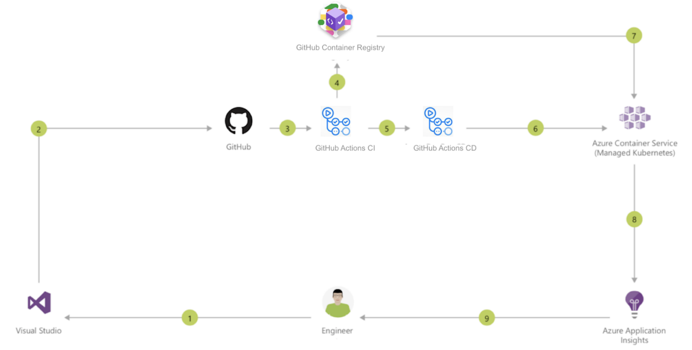

# GitHub Actions with AKS

This sample creates a multi-container application in an Azure Kubernetes Service (AKS) cluster through GitHub Actions. The application interface has been built using Python / Flask. The data component is using Redis. This code is packaged into container images, uploaded to Azure Container Registry, and then run in an AKS cluster..



## Getting Started

1) Fork this repo.
2) Create a free Azure Account with $200 credit (you can use your GitHub account): https://azure.microsoft.com/en-us/free/
3) Go to the Azure Portal: https://ms.portal.azure.com/#home and open the Cloud Shell.
4) Create a resource group
```
az group create --name <RESOURCEGROUPNAME> --location westeurope
```
5) Create an AKS cluster (you have to wait a few minutes)
```
az aks create --resource-group <RESOURCEGROUPNAME> --name <AKSNAME> --node-count 1 --generate-ssh-keys 
```
6) Create a Service Principal.
```
az ad sp create-for-rbac --sdk-auth
```
7) Copy this JSON object, which you can use to authenticate from GitHub. Add it to the following secret variable:
`AZURE_CREDENTIALS`
8) Edit the contents of .github/workflows/main.yml so that the `env` variables are set to match your AKS names defined above

GitHub Actions gives you the flexibility to build an automated software development lifecycle workflow. The Kubernetes action azure/aks-set-context@v1 facilitate deployments to Azure Kubernetes Service clusters. The action sets the target AKS cluster context, which could be used by other actions like azure/k8s-deploy, azure/k8s-create-secret etc. or run any kubectl commands. Check: https://github.com/Azure/actions-workflow-samples/tree/master/Kubernetes

In this example, the workflow is already created in .github/workflows/main.yml. Check this file and change the values for the CLUSTER_NAME, CLUSTER_RESOURCE_GROUP and NAMESPACE environment variables. 
